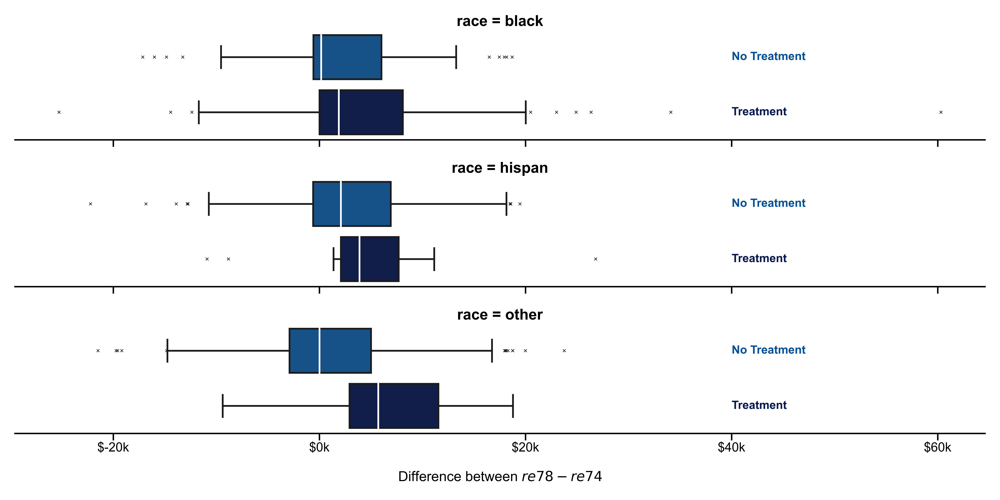
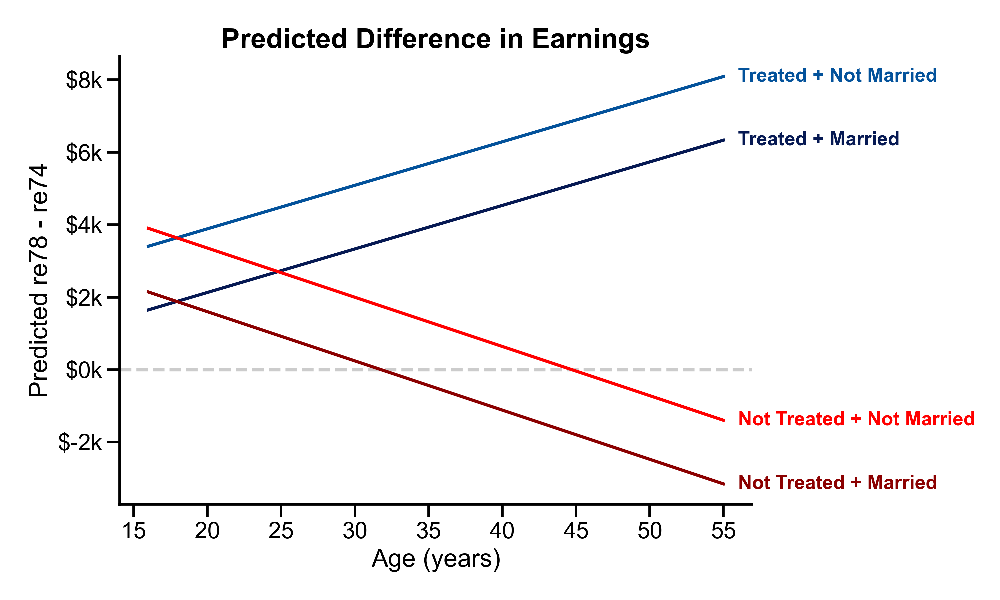
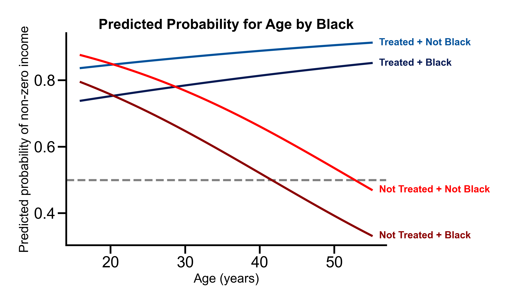

```{r setup, include=FALSE}
knitr::opts_chunk$set(
	echo = FALSE,
	message = FALSE,
	warning = FALSE
)

library(ggplot2)
library(MASS)
library(rms)
library(readr)
library(GGally)
library(knitr)
library(xtable)
library(kableExtra)
library(arm)
library(pROC)
library(e1071)
library(caret)
library(gridExtra)
library(dplyr)
library(stargazer)
library(car)

```


```{r, echo = FALSE, include=FALSE}
#import data files and clean data
rm(list = ls())

data <- read.csv("../Data/lalondedata.txt", sep=',')

```

# Summary
In this study, we examine whether there is evidence that employees who receive job training earn better wages than those who did not receive training. We use linear regression to study the relationship between earning differences and variables such as job training, educational background, and racial identity. We find that while the job training itself does not have a significant effect on the earnings difference between 1974 and 1978 at zero-age, it significantly affects the relationship that age has on the earnings difference. For individuals who received job training, an increase in age is associated with an increase in earnings difference, while the opposite is true for those who did not. This trend is not affected by race, years of schooling, whether or not they have a degree, or marital status. Overall, it is reasonable to conclude that the effects of job training differs mostly by age group and not by any other demographic variables.  
To not only study the pre- and post-training difference in income, we also use a logistic regression model to examine whether job training is associated with a higher odds ratio of having non-zero income in 1978. We find that receiving training at age zero, being black, and an increase in age (without receiving training) are all associated with lower odds of earning non-zero income in 1978, whereas the pre-training income and an increase in age for those who received job training are associated with higher odds.

# Introduction
Many public policy programs in the United States aimed to help improve personal income. In order to evaluate the effectiveness of these public policy programs, a group of researchers conducted several randomized experiments in the 1970s. In this analysis, we used the data set from the National Supported Work Demonstration collected by Robert LaLonde in the 1970s (Lalonde, 1986). Participants of this experiment were randomly assigned to receive job training (treatment) or be part of the control group. Using data from this experiment, we attempt to assess the effectiveness of job training for disadvantaged workers in increasing their wages. 

This analysis primarily focuses on investigating two topics of interest. First, is there evidence that workers who receive job training tend to earn higher wages than workers who do not? Second, is there evidence that workers who receive job training tend to be more likely to have positive (non-zero) wages than workers who do not? To answer these questions, we use linear regression to model the difference between pre- and post-training earnings of 614 workers. Similarly, we use logistic regression to model the odds of having a non-zero income after job training. In both cases, we will also look at whether the effects of job training differ by demographic factors such as age, racial identity, educational status, and marital status and explore whether there are any other interesting associations. Finally, we are also interested in the likely range of effects by job training. 

# Data
## Part 1 - Linear Regression
This data set contains several variables that could be used to assess whether job training for disadvantaged workers is helpful in improving wages. Examining the distribution of pre- and post-training wages, it is evident that a lot of the observations have zero income. This zero inflation of the income variables might lead to issues in model fitting which will be explored in detail later. To account for each individual's pre-training wages, the income variables of interest are the income in 1974 (pre-training), 1978 (post-training), and their difference (which we will refer to as “earnings difference”). We do not use the 1975 income because individuals were undergoing the training during this year and received income for participating in the experiment. Potential predictor variables in this analysis include treatment (received training or not), racial identity (Black, Hispanic, or neither), years of education, degree status, and marital status.

We start exploring the data set by visually inspecting the distribution of potential predictor variables and the relationship between income and these predictors. Among all the predictor variables, `black` and `married` show some association with the 1978 income. In addition, there is a weak correlation ($\rho$=0.34) between `re74` and `re78`, indicating a positive association between the two variables. When box plotting the earnings difference for different subgroups of the data set, the predictors `married`, `hispan` and `treat` appear to be related with the difference in earnings, although the magnitude of the difference in medians is small. Additionally, we visualize several interactions between treatment and other predictors. Specifically, we are interested in the interactions between treatment and race. However, while the earnings difference is higher for treated subjects than it is for non-treated subjects, the visual inspection does not reveal any strong interaction effects, as this effect seems to be consistent across races.




## Part 2 - Logistic Regression
For the second part of our analysis, we binarize the 1978 income to be 1 for people with a non-zero income and 0 otherwise. Subsequently, we examine and test the conditional probabilities for the response variable and each categorical predictor using conditional probability tables as well as the $\chi^2$ test. Among all these predictors, the positive income dummy only seems to be conditionally dependent on black and independent from all other categorical predictors. For the continuous predictors, we use box plots to evaluate whether any independent variable might be predictive of the income group. The variables `educ` and `re74` are the ones that differ most by income group, albeit the effect size is small. After scrutinizing the interaction between treatment and other demographic predictors using probability tables, we find strong interactions between `black` and `treat` and `married` and `treat`, which have to be examined further. It is noteworthy that we cannot draw conclusions from interactions with `hispan` as there are too few data points in this category. After investigating this issue in more detail, we find that the assignment to treatment groups might be biased by race: the distribution of races between the treatment and control group differs vastly which might affect modeling results.

# Model
## Part 1 - Linear Regression

```{r}

data$treat <- as.factor(data$treat)
data$black <- as.factor(data$black)
data$hispan <- as.factor(data$hispan)
data$married <- as.factor(data$married)
data$nodegree <- as.factor(data$nodegree)
data$diff_re <- data$re78 - data$re74


treat_age_int <- lm(diff_re ~ treat + age + married + treat * age, data=data)

```

To fit the linear regression model, we start by defining a null model and full model to use in a stepwise regression process in order to build a parsimonious model. The null model contains only treatment as a predictor variable, whereas the full model contains all relevant variables from the data set without interactions as predictor variables. We use the AIC rather than BIC because the latter is too stringent and removes most variables from the model, which makes it hard to answer our inferential questions. Unfortunately, the resulting model violated most linear regression assumptions: the zero-inflation of the 1978 wages leads to non-randomly distributed residuals, which also do not follow a normal distribution. In an attempt to circumvent these shortcomings, we experimented with different transformations like logging `re78 + 1`, none of which were able to improve the assumptions. Therefore, we proceed to model for the earnings difference rather than absolute earnings. The new response variable also better addresses the question we are interested in answering, because it measures how wages changed post-training. We again use the AIC stepwise model selection algorithm to find the best-fitting model. Still, the null model contains only treatment as a predictor variable and the full model contains all mean effects of variables. The resulting stepwise model includes `treat`, `age`, and `married` as predictors, all of which are significant. We then proceed to examine potential significant interactions between predictors, specifically focusing on the interactions of treatment with the significant predictors from our stepwise model, as well as with `hispan`, and `black` due to our inferential questions. We employ the ANOVA F-test to test our original stepwise model against the stepwise model plus each of these interactions separately and find that treatment and age is our only significant interaction.

```{r, results='asis'}

null_model <- lm(diff_re ~ treat, data=data)
full_model <- lm(diff_re ~ treat + age + educ + black + hispan +
                   married + nodegree,
                 data=data)
step_model <- step(null_model,
                   scope=formula(full_model),
                   direction='both',
                   trace=0)
ftest = anova(step_model, treat_age_int)

cat("\\begin{center}")
xtable(ftest)
cat("\nF-Test for treatment and age interaction\n")
cat("\\end{center}")

```

Therefore, our final model contains `treat`, `age`, `married`, and the `treat`$\times$`age` interaction as seen below. 

$$ {\rm diff\_re}_i = \beta_0 + \beta_1\cdot{\rm treat1}_i + \beta_2\cdot{\rm age}_i+\beta_3\cdot{\rm married1}_i+\beta_4\cdot{\rm treat1}\times{\rm age}_i + \varepsilon_i \\  $$
$$ \varepsilon_i \sim \mathcal{N}(0, \sigma^2), i=1, ..., n $$


Before relying on the estimated final model to answer our inferential questions, all major assumptions of the linear regression model have to be satisfied. After plotting the residuals against the fitted values as well as against the only continuous predictor (age), we did not observe any major violations of the independence, equal variance, and linearity assumptions. The points in these scatter plots appear to fall randomly around zero with no clear trends or patterns between them (see graphs below). In addition, we can observe on the QQ plot that the points fall roughly along the 45-degree line, which suggests that the normality assumption is also satisfied.

```{r, out.width="50%"}
# resid vs. fitted
tempdf = data.frame(fitted=fitted(treat_age_int), residuals=residuals(treat_age_int))
ggplot(data=tempdf, aes(x=fitted, y=residuals)) + 
  geom_abline(slope=0, intercept=0, color='#aaaaaa', linetype='dashed') +
  geom_point(color='#061953') + 
  theme_classic() + 
  labs(x="Fitted Values", y="Residuals") + 
  ggtitle("Residuals vs. Fitted Plot") + 
  theme(plot.title=element_text(size=16, face='bold', hjust=0.5)) +
  scale_y_continuous(labels= function(x) paste("$", as.numeric(x)/1000, "k"))
  

# QQ-plot
ggplot(data=tempdf, aes(sample=residuals)) + 
  stat_qq_line(linetype='dashed', color="#888888") + 
  stat_qq(color='#061953') + 
  theme_classic() +
  labs(x="Theoretical Quantiles", y="Empirical Quantiles") + 
  ggtitle("Residuals QQ-Plot") + 
  theme(plot.title=element_text(size=16, face='bold', hjust=0.5)) +
  scale_y_continuous(labels= function(x) paste("$", as.numeric(x)/1000, "k"))
```


Notably, all of the scatter plots contain several outliers, one of which has a specifically large residual (data point #132). Its effect on the fitted model has to be examined to decide whether it should be excluded. According to the studentized residuals versus leverage plot, while data point #132 is a high leverage point it can be considered a non-influential outlier as the Cook’s distance of this point does not exceed the critical threshold. Thus, it does not need to be excluded before modeling as its effect on the estimated model is negligible. Finally, we assess whether there is a concerning level of multicollinearity present between predictors. Calculating the VIF for each non-categorical predictor reveals that multicollinearity does not seem to be an issue as each predictors’ VIF is close to 1, so we can proceed to interpret the fitted model.

The linear regression model provided insights into relationships between the response variable and the predictor variables. The coefficient of treatment could help to quantify the effect of treatment on disadvantaged workers’ wages. From the final model summary below, it is evident that the mean effect of treatment at age zero is insignificant. Moreover, the 95% confidence interval for the effect of treatment is (-9,268, 95). This range contains 0, therefore we cannot interpret its coefficient because it could be either a positive or negative influence. 


```{r}

summary_final = summary(treat_age_int)
summaryprint = data.frame(summary_final$coefficients[,1:2])
pvalprint = data.frame(summary_final$coefficients[,4])

stars = c("***",".", "***", "*", "**")
starsdf = data.frame(stars)
confintdf = data.frame(round(confint(treat_age_int, level = 0.95),2))

summarydf = data.frame(cbind(round(summaryprint,2), round(pvalprint,4), round(confintdf,2),starsdf))
colnames(summarydf) = c("Estimate","Std. Error", "Pr(>|t|)","Lower Bound", "Upper Bound","")
knitr::kable(summarydf, format="latex", booktabs=TRUE, caption="Linear regression model summary") %>% 
  kable_styling(latex_options="hold_position")

```


Both age and the `treat1`$\times$`age` interaction are significant in the model. The coefficient of age is negative, which indicates that given the worker is untreated, as age increases by one year, the change in wages would decrease by \$135.79. The coefficient for `treat1`$\times$`age` interaction is positive. Therefore, given the worker is treated, every increase in age by one year is associated with an increase in earnings difference by \$120,09 (= -\$135.79 + \$255.88). Independent from the treatment, marital status is also significant to the model. The coefficient of marital status is negative, which means workers who are married are associated with a \$1756.52 decrease in earnings difference compared to workers who are not married. This effect is displayed in Figure 2: being married offsets the model’s prediction by a constant amount and treatment changes the direction of the relationship between age and earnings difference.

```{r, out.width="70%", fig.align='center', fig.cap=""}


```

Overall, racial identity and educational background have minimal effect on the response variable. The stepwise selection process eliminated their mean effects and the F-Test failed to reject the $H_0$ that the coefficients of the interactions of `black`, `hispan`, `educ`, and `nodegree` with `treat` are different from zero. The same holds for the interaction between `treat` and `married` as well as `married` and `age`. This is consistent with our findings from the EDA so we can conclude that we were unable to find evidence that the treatment effect differs by the demographic group with the exception of age. There are no additional noteworthy associations with the earnings difference.

## Part 2 - Logistic Regression

```{r}
data$X <- NULL
data$treat <- as.factor(data$treat)
data$black <- as.factor(data$black)
data$hispan <- as.factor(data$hispan)
data$married <- as.factor(data$married)
data$nodegree <- as.factor(data$nodegree)
data$pos_income <- as.integer(data$re78 > 0)
data$pos_income_f <- as.factor(data$pos_income)
data$re74_bin <- ifelse(data$re74>0, 1, 0)
data$re74_bin <- as.factor(data$re74_bin)

age_int <- glm(pos_income_f ~ treat + black + 
                       age + re74 + treat * age,
                     data=data, family=binomial)
```


In part 2 of the analysis, we use a logistic regression model to evaluate if job training is associated with workers receiving non-zero wages. The response variable in this model is the binarized variable re78, with positive earnings were encoded as 1, and zero earnings were encoded as 0. Potential predictor variables include all relevant variables from the data set. Again, we used the AIC stepwise model selection algorithm to find the best-performing model. The null model uses treatment as the only predictor variable. The full model contained all predictor variables without interactions. Stepwise AIC suggests that `treat`, `age`, `re74`, and `black` are predictive variables in the logistic regression model. Next, we explore interactions that could be significant to the model. We test the `treat`$\times$`black`, `treat`$\times$`married`, `treat`$\times$`hispan`, and `treat`$\times$`age` interactions separately against the suggested model using the ANOVA $\chi^2$ test. The $\chi^2$ test suggests that all interactions are insignificant to the model except for the `treat`$\times$`age` interaction. After adding the `treat`$\times$`age` interaction to the suggested model, we obtained our final logistic regression model.

$${\rm re78\_pos}_i \hspace{1 mm} | \hspace{1 mm} {\rm treat1}_i, {\rm age}_i, {\rm re74}_i, {\rm black1}_i, {\rm treat1}\times{\rm age}_i \hspace{3 mm}{\sim}\hspace{3 mm}  \text{Bernoulli}(\pi_i);$$
$$\log \left( \frac{\pi_i}{1-\pi_i}\right)= \beta_0 + \beta_1\cdot{\rm treat1}_i + \beta_2\cdot{\rm age}_i+\beta_3\cdot{\rm re74}_i+\beta_4\cdot{\rm black1}_i+\beta_5\cdot{\rm treat1}_i\times{\rm age}_i $$

Before interpreting the fitted model’s coefficients, we examine the binned residuals vs. predicted probabilities, the binned residuals vs `age`, and the binned residuals vs `re74` plots. As all points in the plots appear randomly distributed around zero and mostly fall within the error bands, we are comfortable with using this model to answer our inferential question.

```{r, out.width="33.33%"}
rawresid1 <- residuals(age_int, "resp")
binnedplot(x=fitted(age_int),y=rawresid1,
           xlab="Pred. probabilities",
           col.int="red3", ylab="Avg. residuals",
           main="Binned residual plot", col.pts="#061953")

binnedplot(x=data$age,y=rawresid1,
           xlab="Age",
           col.int="red3", ylab="Avg. residuals",
           main="Binned residual plot", col.pts="#061953")

binnedplot(x=data$re74,y=rawresid1,
           xlab="Income in 1974",
           col.int="red3", ylab="Avg. residuals",
           main="Binned residual plot", col.pts="#061953")


```


The logistic regression model helped to quantify the effects of job training on receiving non-zero wages for disadvantaged workers. The model summary table below shows that all predictors are significant in this model. The coefficient of treatment is negative. The odds ratio of getting a non-zero wage in 1978 for trained disadvantaged workers at age zero is 0.22 ($=\exp(-1.51)$) i.e. job training for disadvantaged workers at age zero is associated with roughly 88% fewer odds in getting non-zero wages. In addition, we captured the likely range of the effect of training by calculating the 95% confidence interval, which exponentiates to (0.05, 0.94). Since both the lower bound and upper bound of the confidence interval are below 1 (on the log-odds scale), we conclude that workers who received job training have a lower odds ratio of earning non-zero wages compared to workers who didn’t receive job training. This indicates that treatment itself does not help increase the odds of getting non-zero wages. Given no treatment, the effects of age on the odds of receiving a positive salary are negative. A one-year increase in age is associated with a 5.2% decrease ($=\exp(-.0537)-1$) in odds of receiving a positive salary. Giving treatment, however, reverses the nature of this relationship: for treated subjects, a year increase in age is associated with a 1.99% increase ($=\exp(-0.0537 + 0.0734)-1$) in the odds of receiving a non-zero salary. When the participant is identified as black, their odds ratio of earning a positive salary is 46.3% ($=\exp(-0.6217)-1$) lower in comparison to a non-black participant. Finally, an additional \$1,000 of income in 1974 is associated with a 10.52% increase ($=\exp(0.0001 * 1,000)$) in odds of earning a non-zero salary in 1978. 


```{r, out.width="70%", fig.align='center', fig.cap="sdfasd"}
knitr::opts_chunk$set(fig.pos = "!H", out.extra = "")


```


Figure 3 displays the predicted probability of earning a positive salary over all ages for subjects colored by their treatment status and whether they are black. The offset induced by the negative coefficient for `black` as well as the changing nature of the relationship between treated and untreated people is clearly visible.

We can conclude that `treat` at age zero negatively impacts the odds of receiving a positive salary in 1978. Similarly, aging for untreated subjects is also associated with a decrease in odds. However, the treatment is able to change the direction of this relationship: an increase in age for the subjects who received training is associated with higher odds of receiving a non-zero salary.


```{r, fig.cap='captioncaption'}

summary_final = summary(age_int)
summaryprint = data.frame(summary_final$coefficients[,-3])

stars = c("***","*", "*", "***", "***", "**")
starsdf = data.frame(stars)
confintdf = data.frame(round(confint(age_int, level = 0.95),4))

summarydf = data.frame(cbind(round(summaryprint,4), confintdf,starsdf))
colnames(summarydf) = c("Estimate","Std. Error", "Pr(>|z|)","Lower Bound", "Upper Bound","")
knitr::kable(summarydf, format="latex", booktabs=TRUE, caption="caption here") %>% 
  kable_styling(latex_options="hold_position")
```


To also assess the predictive power of the model, we calculate the AUC and accuracy score. While the AUC score of the model is 0.644, a cutoff value has to be chosen to calculate an accuracy score. Table 3 compares three different strategies of cutoff values: the recommended cutoff by the AUC plot, the 0.5 standard cutoff, or the mean value of response variable cutoff.

| Strategy | Threshold | Accuracy | Sensitivity | Specificity |
|:---|:---:|:---:|:---:|:---:|
| Recommended | 0.737 | 0.648  | 0.683 | 0.531 |
| 0.5 | 0.500 | 0.776  | 0.980 | 0.104 |
| Mean | 0.767  | 0.604  | 0.603 | 0.608 |

Table: Model performance for different classification thresholds

The predictive power of the final model seems poor as only the 0.5 threshold delivers better accuracy than a naive baseline model which always predicts the majority class. However, depending on whether high sensitivity or specificity is required by the stakeholders, one of the other thresholds could be chosen. 

# Conclusion

In this study, we examined the effects of job training on wages for disadvantaged workers with different demographic characteristics. We used linear regression to model the increase in earnings after training as well as logistic regression to model the odds of having a non-zero income after training. After accounting for the interaction between treatment and age, our linear regression model suggests that treatment mostly affects the relationship between age and earnings increase positively while its direct effect is negative. This effect is independent of other demographic characteristics like race, marital status, or educational background. Interestingly, the earnings difference for married subjects is lower than the one for non-married people, but no additional associations with earnings difference was notable. Another topic of interest is the effect of job training on receiving non-zero wages for disadvantaged workers. Our logistic regression model suggests that the effect of treatment by itself is negative, however, similar to the results from the linear regression analysis, it changes the association between age and the odds of earning a non-zero income. Still, this effect is independent of other demographic characteristics. Interestingly, for modeling the odds of receiving a non-zero wage, the predictors `black` and `re74` are significant in the model. We can conclude that black subjects are less likely to earn a positive wage in 1978 than non-black subjects and that a higher pre-training salary is associated with higher odds of earning a positive salary. 

It is worth mentioning that the linear regression model and the logistic regression model both suggested the effect of treatment could differ by age. In both cases, treatment by itself could have a limited effect on the response variable. However, when treatment is offered, an increase in age is associated with both the increase in wages and the odds of getting non-zero wages. This could suggest that job training could be helpful for workers who are more elderly. 

One limitation of our linear regression model is the low $R^2$ value. Because the $R^2$ is equal to 0.074, it implies that the final model only accounts for 7.4% of the variation in the data.  We suspect that due to omitted variables, future research should examine additional aspects like skill level or profession to improve the model. The logistic regression model faces similar issues as its predictive performance hardly beats the naive baseline of predicting the majority class.
Moreover, there are also limitations within the data set that could’ve impacted the performance of our model. First, all participants recorded in this data set are males, which makes our result not generalize to the entire workforce. Second, the data set used in this analysis is only a subset of the original data, which might be the reason for the different race distributions for the treatment and control groups. This subsetting process has likely induced severe selection bias. To alleviate the effects of these limitations, future research could reconstruct the linear regression and logistic regression model using the original complete data set collected in the 1970s or repeat a similar experiment to be more relevant for current times.

\newpage

# Citations
Lalonde, R. J. (1986), Evaluating the econometric evaluations of training programs with experimental data, *The American Economic Review*, 76, 604 - 620.

