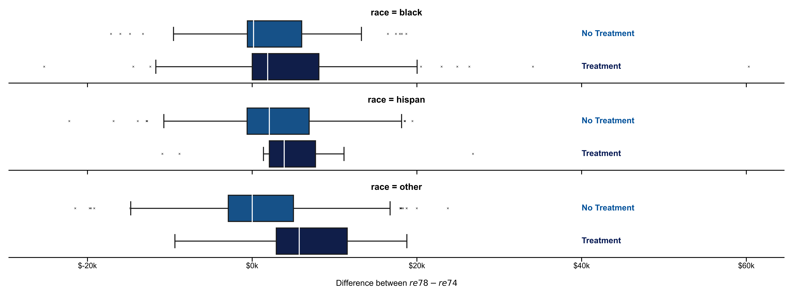

```{r setup, include=FALSE}
knitr::opts_chunk$set(
	echo = FALSE,
	message = FALSE,
	warning = FALSE
)

library(ggplot2)
library(MASS)
library(rms)
library(readr)
library(GGally)
library(knitr)
library(xtable)
options(xtable.comment = FALSE, xtable.floating = FALSE)
library(kableExtra)
library(arm)
library(pROC)
library(e1071)
library(caret)
library(gridExtra)
library(dplyr)
library(stargazer)
library(car)

```


```{r, echo = FALSE, include=FALSE}
#import data files and clean data
rm(list = ls())

data <- read.csv("../Data/lalondedata.txt", sep=',')

data$treat <- as.factor(data$treat)
data$black <- as.factor(data$black)
data$hispan <- as.factor(data$hispan)
data$married <- as.factor(data$married)
data$nodegree <- as.factor(data$nodegree)
data$diff_re <- data$re78 - data$re75
```

# Summary
In this study, we examine whether there is evidence that employees who receive job training earn better wages than those who did not receive training. We use linear regression to study the relationship between earning differences and variables such as job training, educational background, and racial identity. We find that while the job training itself does not have a significant effect on the earnings difference between 1974 and 1978 at zero-age, it significantly affects the relationship that age has on the earnings difference. For individuals who received job training, an increase in age is associated with an increase in earnings difference, while the opposite is true for those who did not. This trend is not affected by race, years of schooling, whether or not they have a degree, or marital status. Overall, it is reasonable to conclude that the effects of job training differs mostly by age group and not by any other demographic variables.  
To not only study the pre- and post-training difference in income, we also use a logistic regression model to examine whether job training is associated with a higher odds ratio of having non-zero income in 1978. We find that receiving training at age zero, being black, and an increase in age (without receiving training) are all associated with lower odds of earning non-zero income in 1978, whereas the pre-training income and an increase in age for those who received job training are associated with higher odds.

# Introduction
Many public policy programs in the United States aimed to help improve personal income. In order to evaluate the effectiveness of these public policy programs, a group of researchers conducted several randomized experiments in the 1970s. In this analysis, we used the data set from the National Supported Work Demonstration collected by Robert LaLonde in the 1970s (Lalonde, 1986). Participants of this experiment were randomly assigned to receive job training (treatment) or be part of the control group. Using data from this experiment, we attempt to assess the effectiveness of job training for disadvantaged workers in increasing their wages. 

This analysis primarily focuses on investigating two topics of interest. First, is there evidence that workers who receive job training tend to earn higher wages than workers who do not? Second, is there evidence that workers who receive job training tend to be more likely to have positive (non-zero) wages than workers who do not? To answer these questions, we use linear regression to model the difference between pre- and post-training earnings of 614 workers. Similarly, we use logistic regression to model the odds of having a non-zero income after job training. In both cases, we will also look at whether the effects of job training differ by demographic factors such as age, racial identity, educational status, and marital status and explore whether there are any other interesting associations. Finally, we are also interested in the likely range of effects by job training. 

# Data
## Part 1 - Linear Regression
This data set contains several variables that could be used to assess whether job training for disadvantaged workers is helpful in improving wages. Examining the distribution of pre- and post-training wages, it is evident that a lot of the observations have zero income. This zero inflation of the income variables might lead to issues in model fitting which will be explored in detail later. To account for each individual's pre-training wages, the income variables of interest are the income in 1974 (pre-training), 1978 (post-training), and their difference (which we will refer to as “earnings difference”). We do not use the 1975 income because individuals were undergoing the training during this year and received income for participating in the experiment. Potential predictor variables in this analysis include treatment (received training or not), racial identity (Black, Hispanic, or neither), years of education, degree status, and marital status.

We start exploring the dataset by visually inspecting the distribution of potential predictor variables and the relationship between income and these predictors. Among all the predictor variables, `black` and `married` show some association with the 1978 income. In addition, there is a weak correlation ($\rho$=0.34) between `re74` and `re78`, indicating a positive association between the two variables. When box plotting the earnings difference for different subgroups of the data set, the predictors `married`, `hispan` and `treat` appear to be related with the difference in earnings, although the magnitude of the difference in medians is small. Additionally, we visualize several interactions between treatment and other predictors. Specifically, we are interested in the interactions between treatment and race. However, while the earnings difference is higher for treated subjects than it is for non-treated subjects, the visual inspection does not reveal any strong interaction effects, as this effect seems to be consistent across races.



For the second part of our analysis, we binarize the 1978 income to be 1 for people with a non-zero income and 0 otherwise. Subsequently, we examine and test the conditional probabilities for the response variable and each categorical predictor using conditional probability tables as well as the $\Chi^2$ test. Among all these predictors, the positive income dummy only seems to be conditionally dependent on black and independent from all other categorical predictors [REF chi2 for black??]. For the continuous predictors, we use box plots to evaluate whether any independent variable might be predictive of the income group. The variables educ and re74 are the ones that differ most by income group, albeit the effect size is small. After scrutinizing the interaction between treatment and other demographic predictors using probability tables, we find strong interactions between black and treat and married and treat which have to be examined further. It is noteworthy that we cannot draw conclusions from interactions with hispan as there are too few data points in this category. After investigating this issue in more detail we find that the assignment to treatment groups might be biased by race: the distribution of races between the treatment and control group differs vastly which might affect modeling results.

